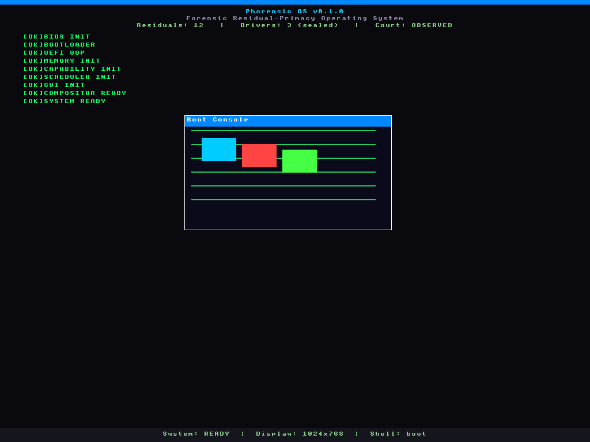

# Phorensicos — Phorensic OS



**Phorensic OS** is a research operating system built around *residual primacy*:
every state change emits a **residual** — a signed, replayable evidence record —
so that the system's history is always reconstructable and auditable. Authority
is granted only through **affine capabilities** (no ambient authority), and there
is no unverified state change.

The project is deliberately small in its trusted core and aspirational in its
design: it pairs a `no_std` x86-64 kernel with a bootstrap compiler for a
purpose-built language (`.ph` / `.phor`).

> **Status: bootstrapping / observed.** The compiler pipeline, the host runtime
> and the booted GUI kernel are all working end-to-end and covered by tests.
> The language checker and the code generator are still maturing, so parts of the
> `src/**/*.phor` corpus lower successfully while still producing checker
> diagnostics. See [Current status](#current-status) for exact numbers.

---

## Repository layout

| Path | What it is |
|------|------------|
| `phorc/` | **Bootstrap compiler** — `.ph`/`.phor` → ELF64 object, byte-attribution receipts and sealed packages. Lexer → parser → checker → PHIR → x86-64 → ELF64. |
| `phost/` | **Host / runtime library** — canvas, console, compositor, shell, status screen, serial + PS/2 keyboard drivers, and the kernel `nucleus` (GDT/IDT/TSS/paging, assembly shims). Builds with `std`, `alloc`, or `no_std`. |
| `phost_kernel/` | **`no_std` kernel staticlib** — links the boot stub into a Multiboot image that renders a GUI to the QEMU VGA framebuffer. |
| `src/` | **Phorensic OS system source** (~232 `.phor` modules): kernel, memory, drivers, forensic store, courts, dialect cages, GUI, package system, porting engine, … |
| `examples/` | 44 runnable `.phor` examples (shell, compositor, drivers, courts, porting). |
| `tests/` | `.phor` test suites plus `compile-pass/` fixtures. |
| `fixtures/` | Golden residual/oracle/court fixtures and package specs. |
| `docs/` | Language, compiler, kernel, store, courts, GUI and reviewer specifications. |

## Toolchain

- Rust (stable) — builds `phorc`, `phost`.
- `rustup target add x86_64-unknown-none` — required for the kernel.
- `nasm`, `ld.lld` and `objcopy` (binutils) — kernel stub assembly + link.
- `qemu-system-x86_64` — optional, for booting the kernel.

## Quick start

```sh
# 1. Build and test the host workspace (phorc + phost)
cargo test

# 2. Compile a Phorensic program end-to-end to an ELF64 object
cargo run -p phorc -- examples/hello.phor /tmp/hello.o \
    --emit-receipts --emit-seal

# 3. Verify the seal and run the evidence court
cargo run -p phorc -- --verify-seal /tmp/hello.sealed_package.json
cargo run -p phorc -- --court-replay /tmp/hello.sealed_package.json
```

`phorc --help` lists the full option set (`--emit-receipts`, `--emit-kernel`,
`--emit-seal`, `--verify-seal`, `--court-verify`, `--court-replay`).

### Build and boot the kernel in QEMU

```sh
cd phost_kernel
rustup target add x86_64-unknown-none   # once
./build_kernel.sh                       # staticlib → nasm stub → ld.lld → flat image
./boot_qemu.sh phorensic-kernel.elf evidence 8
./verify_evidence.sh evidence           # proof bytes, ABI @0x300000, screen palette
./evidence_manifest.sh evidence         # refresh evidence_manifest.json
cat evidence/serial.log evidence/debug.log
```

On a successful boot the kernel writes its proof bytes (`Ph`) to both COM1
(`0x3F8`) and the QEMU debug port (`0xE9`), and the 1024×768 boot GUI is rendered
to the linear framebuffer (`evidence/screen.ppm`). `verify_evidence.sh` checks
all of that (13 checks) and `evidence_manifest.sh` records the hashes, the
framebuffer ABI location (`0x300000`) and the exact commands/toolchain used.
The committed manifest is `phost_kernel/evidence_manifest.json`; the raw dumps
stay gitignored.

The manifest is deliberately two-tier, so its claim cannot be misread:

- `asserted_reproducible_evidence` — the five captured boot-evidence artifacts
  (`serial.log`, `debug.log`, `screen.ppm`, `fb-abi.bin`, `lfb.bin`). These are
  the court evidence and **are** asserted byte-identical across hosts and
  containers (the kernel CI checks all five against the committed manifest).
- `observed_toolchain_bound_build` — the kernel image hash/size, recorded with
  `asserted_reproducible: false` because image bytes depend on the
  rustc/nasm/ld.lld/binutils versions. Useful as an observed build fact; **not**
  a cross-toolchain reproducibility guarantee.

A top-level `manifest_claim` states exactly what is and is not asserted.

> `phost_kernel` is a `no_std` staticlib cross-compiled for
> `x86_64-unknown-none`, so it is excluded from the default workspace build. Use
> `build_kernel.sh` (it sets the target via `phost_kernel/.cargo/config.toml`).

## JIT-Porting Court

Phorensic OS ports *behavior*, not binaries. Two courts have run end-to-end at
the API boundary:

```text
foreign behavior → dialect cage       (observe libc as a black box)
                 → oracle traces      (sealed, ordered, locale-recorded cases)
                 → behavior signature (combined SHA-256 oracle hash)
                 → native candidate   (clean-room phor_*)
                 → replay court       (replay the full case set)
                 → comparison         (exact output / status / effects)
                 → promotion          (only on an exact match)
                 → sealed package     (native:<qualified target id>)
                 → execution court    (load the sealed ELF64 object and call it)
                 → dispatch court     (the runtime serves calls from the sealed object)
```

| Target | Corpus | Replay | Executed object | Runtime dispatch |
|--------|--------|--------|-----------------|------------------|
| `libc:toupper:c-locale:u8:v1` | exhaustive `0x00..=0xff` (256 cases) | **256/256 pass** | **256/256 pass** | **256/256 native**, 0 fallback |
| `libc:memcmp:c-locale:sign:v1` | bounded deterministic corpus (312 cases) | **312/312 pass** | **312/312 pass** | **312/312 native**, 0 fallback |

The `memcmp` corpus deliberately forces length, buffers and ordering: lengths
`0..=8`, five patterns, every first-mismatch position, the `n`-boundary around a
mismatch, and the unsigned edge bytes `00/01/7f/80/fe/ff`. Its observable is the
**sign** of the return value (`-1 | 0 | 1`), which is the C contract.

```sh
cargo run -p phost -- port promote toupper   # observe → replay → execute → dispatch → seal
cargo run -p phost -- port promote memcmp
cargo run -p phost -- port native toupper 61              # call site: run the sealed object
cargo run -p phost -- port native memcmp 616263:616264:0300000000000000
cargo run -p phost -- port native toupper 61 --no-capability   # → foreign fallback
./verify_jit_porting_court.sh --target toupper             # determinism court
./verify_jit_porting_court.sh --target memcmp
./verify_jit_porting_court.sh --target memcmp --check-committed   # fresh == checked-in
```

Verified: the seals bind the **qualified target id** (`libc:memcmp:c-locale:sign:v1`),
the **locale contract** (`C`), the **candidate behavior hash**, and the compiled
candidate artifacts — **source hash**, **ELF64 object hash**, **receipt hash**,
and **compiler version**. So a locale change, an edited `.phor` candidate, or a
recompiled object invalidates the seal.

The **compiled `.phor` object is the authoritative promoted implementation**, and
it is **loaded and executed**: the court invokes `phorc` on the target's `.phor`
source, hashes the emitted object and its receipt file, then maps the sealed ELF64
object, locates the ABI entry symbol (`_phor_phor_toupper` / `_phor_phor_memcmp_sign`),
rejects any entry point with relocations or external symbols, and replays the exact
same corpus through the compiled code. Promotion now requires *both* the replay
court and the execution court to match. The verifier independently recompiles and
confirms the object/receipt hashes match the committed seal (`Compiled object:
MATCH`) and that the executed object is the sealed object (`Execution object:
MATCH`). Evidence is committed under `phost/evidence/porting/{toupper,memcmp}/`
including `execution_verdict.json`; the compiled `candidate.o` and
`candidate.receipts.json` are regenerated, not committed.

Executed ABI (SysV AMD64, leaf/pure integer functions only):

| Entry symbol | Signature | Result |
|--------------|-----------|--------|
| `_phor_phor_toupper` | `(u64 byte) -> u64` | folded byte in the low 8 bits |
| `_phor_phor_memcmp_sign` | `(u64 wa, u64 wb, u64 n) -> u64` | `i64` sign `-1 \| 0 \| 1`; buffers packed big-endian |

At a call site the **runtime dispatcher** (`phost::porting::dispatch`) looks the
target up in the capability-gated sealed store and, if a sealed entry is present,
verifies the object hash, maps the entry function **once** and calls it. With no
usable sealed artifact the call reports a **foreign fallback** so the caller uses
the foreign implementation — except when a *sealed* entry exists but fails
verification, which is terminal (fail closed) and never falls back. The dispatch
court replays the whole corpus through this path and requires every case to be
served natively with zero fallbacks.

The verifier has two courts: the default regenerates the evidence twice and
requires byte-identical runs; `--check-committed` writes only to a temp dir and
compares against the checked-in evidence without touching it (reviewer-grade).
An unsupported candidate fails closed (`UnsupportedTarget`) and can never pass as
an identity transform; malformed arguments fail closed too.

This is **API-surface** JIT-porting, not arbitrary binary translation — eager JIT
of arbitrary foreign binaries is a later phase. The execution court deliberately
executes **only** leaf, pure, relocation-free integer functions: no dynamic
linker, no heap, no syscalls, no arbitrary binary translation. It is a proof that
the promoted artifact itself runs, not a general execution engine.
See `docs/REPLAY_COURTS.md` and `docs/PHORENSIC_OS.md`.

## Reproducible runs with Docker

Two minimal, resource-capped containers (QEMU boots inside the kernel one):

```sh
docker compose run --rm host     # cargo test + the JIT-porting court verifier
docker compose run --rm kernel   # build kernel + QEMU boot + evidence verify
docker compose up --build        # both, one shot
```

`host` runs the compiler/runtime tests and the court verifier. `kernel` builds the
Multiboot kernel, boots it under QEMU, verifies the boot evidence (13 checks) and
checks the boot evidence is byte-reproducible against the committed
`phost_kernel/evidence_manifest.json`. Boot evidence is byte-identical across
hosts and containers (the manifest's `asserted_reproducible_evidence`); kernel
*image* bytes additionally depend on the linker toolchain
(`nasm`/`ld.lld`/binutils), so they are recorded under
`observed_toolchain_bound_build` with `asserted_reproducible: false`.

## Current status

All numbers below were reproduced on a clean checkout.

| Check | Result |
|-------|--------|
| `cargo test` (phorc) | **48 / 48 pass** (44 unit + 4 lowering-integration) |
| `cargo test` (phost) | **122 pass, 0 fail, 4 ignored** (the 4 ignored read privileged CR0/CR2/CR3/CR4 and require ring 0) |
| `.phor` / `.ph` → ELF64 | all corpus sources emit objects: `src/` (235), `examples/` (46), `tests/` (34 `.phor`), `tests/compile-pass/` (46) |
| Compiler pipeline | `hello.phor` → 6960-byte ELF64 relocatable + receipts + sealed package |
| Seal verification | source hash **MATCH**, object hash **MATCH** |
| Court replay | 6 / 6 phases **PASS**, verdict `consistent` |
| Kernel | builds a valid Multiboot v1 image (magic `02 b0 ad 1b`) |
| Kernel boot (QEMU) | `Ph` on COM1 and `0xE9`; 1024×768 boot GUI rendered to the LFB |
| Boot evidence | `verify_evidence.sh`: **13 / 13 checks pass**; manifest committed; evidence byte-reproducible |
| JIT-porting court | `toupper`: **256/256**, `memcmp`: **312/312**, hashes MATCH, source+object+receipt bound, promotion `Sealed` |
| Sealed-object execution | the sealed ELF64 object is loaded and called: `toupper` **256/256**, `memcmp` **312/312**; executed object == sealed object |
| Sealed native dispatch | the runtime serves calls from the sealed object: `toupper` **256/256 native**, `memcmp` **312/312 native**, **0 fallbacks / 0 broken seals**; no capability → foreign fallback |
| Compiled candidate authority | `phorc` compiles each `.phor` candidate; object/receipt hashes match an independent recompilation and a fresh container run |
| Docker | `docker compose run --rm host` / `kernel` reproduce the tests, the court, and the QEMU boot |

### Known gaps

- **Checker depth.** The bootstrap checker reports diagnostics for constructs
  outside its current subset (e.g. `Option`/`Result` as bare enums, some
  top-level forms) while still lowering them. It is a working front end, not a
  finished type system.
- **Backend maturity.** Register allocation, memory operands and the call ABI
  are minimal; codegen focuses on the boot/runtime path.
- **Interactive runtime.** The boot path renders the GUI surface and halts;
  the interactive shell/presentation loop is future work.
- **`.phor` ↔ Rust convergence.** Drivers/compositor exist both as `.phor`
  sources and as `phost` Rust modules; unifying them is in progress.
- **Porting scope.** The JIT-porting court covers API-surface (byte-in/byte-out)
  targets only; arbitrary binary translation is not implemented.
- **Kernel image bytes.** Boot evidence is byte-reproducible, but kernel image
  bytes depend on the linker toolchain; cross-toolchain bit-reproducibility is
  not yet asserted.

## Documentation

- `docs/PHORENSIC_LANGUAGE.md`, `docs/PHORENSIC_GRAMMAR.md` — the language.
- `docs/PHORENSIC_COMPILER.md` — pipeline and artifact tiers.
- `docs/FORENSIC_STORE.md`, `docs/REPLAY_COURTS.md` — evidence store and courts.
- `docs/PHORENSIC_OS.md`, `docs/FORENSIC_OS_VISION.md` — the OS.
- `docker-compose.yml`, `docker/` — reproducible host + kernel containers.
- `docs/REVIEWER_PROTOCOL.md` — how to review claims in this repo.
- `VERIFICATION_REPORT.md` — detailed build/boot verification notes.

## License

Licensed under either of **MIT** or **Apache-2.0**, at your option
(`LICENSE-MIT`, `LICENSE-APACHE`).
